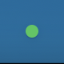
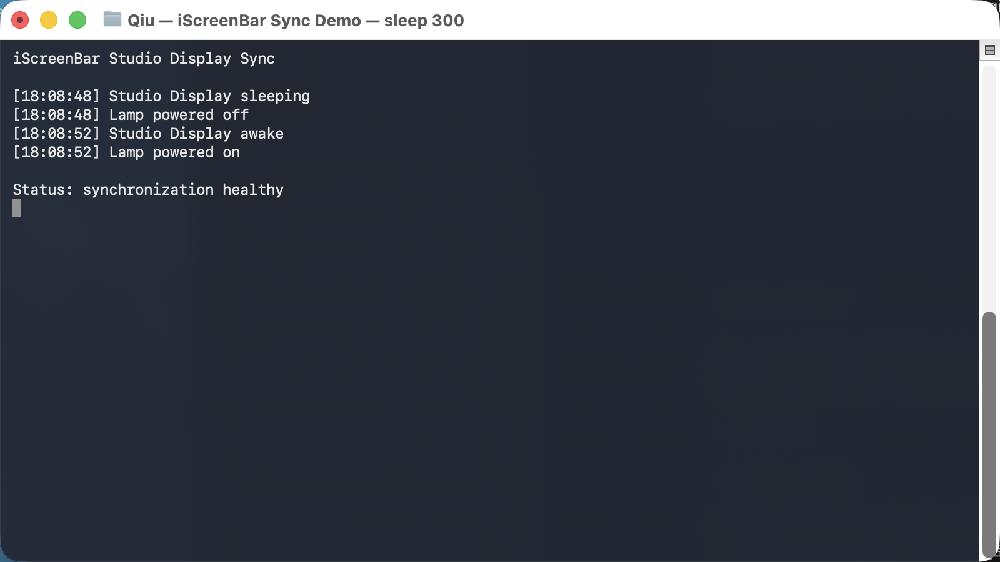

# iScreenBar Studio Display Sync

An unofficial, local-only macOS compatibility utility that synchronizes a BenQ
iScreenBar with Apple Studio Display sleep and wake events.

一个非官方、本地运行的 macOS 兼容工具：Apple Studio Display 熄屏时自动关闭
BenQ iScreenBar，显示器唤醒时自动开灯。

## Why

BenQ's iScreenBar is designed for supported iMac models. Its original macOS app
does not synchronize the lamp when an Apple Studio Display sleeps independently.
This utility fills that single compatibility gap without modifying the original
app, the lamp firmware, or macOS.

## Features

- Studio Display sleeps -> iScreenBar turns off.
- Studio Display wakes -> iScreenBar turns on.
- Menu-bar control panel for lamp power, brightness, color temperature, and automatic ambient-light adjustment.
- Optional Studio Display brightness following that preserves the current
  brightness difference between the display and lamp.
- Menu-bar brightness icon shows the active brightness-following state.
- The icon turns red if the USB connection or a power command fails.
- Detects USB removal and automatically restores synchronization after the lamp reconnects.
- Hover text shows the current display/synchronization state.
- Starts automatically after login using a per-user LaunchAgent.
- No network access, analytics, cloud service, or account requirement.
- Recoverable uninstaller moves installed files to Trash.

## Screenshots

### Menu-bar health indicator



The dot is green while synchronization is healthy and changes to red after a
USB control failure.

### Observed sleep/wake synchronization



## Tested setup

- Apple-silicon Mac running macOS 26
- Apple Studio Display
- BenQ iScreenBar USB HID device
  - Vendor ID: `0x04A5`
  - Product ID: `0x2501`

Other macOS versions and hardware combinations may work but have not been
physically verified. The current display selector chooses the largest external
display reported by Core Graphics.

## Requirements

- macOS with Xcode Command Line Tools (`xcode-select --install`)
- BenQ iScreenBar connected to the Mac over USB
- Apple Studio Display connected and visible to macOS
- The original BenQ app may remain installed and running

## Install

```bash
git clone https://github.com/rogerbush007-a11y/iScreenBar-StudioDisplay-Sync.git
cd iScreenBar-StudioDisplay-Sync
./scripts/install.sh
```

The installer:

1. builds a native app locally;
2. installs it to `~/Applications`;
3. creates a per-user LaunchAgent;
4. starts the synchronization service.

No administrator password is required by the installer.

## Verify

Look for the small green dot in the macOS menu bar, then let Studio Display
sleep naturally. The lamp should turn off and return when the display wakes.

Runtime log:

```bash
tail -f ~/Library/Logs/iScreenBarStudioSync.log
```

Service state:

```bash
launchctl print gui/$(id -u)/local.qiu.iScreenBarStudioSync
```

## Uninstall

```bash
./scripts/uninstall.sh
```

The service is stopped and its app and LaunchAgent are moved to Trash. The log
is preserved for troubleshooting and can be deleted manually.

## Build only

```bash
./scripts/build.sh
```

The app is written to `build/iScreenBar Studio Display Sync.app` and ad-hoc
signed locally.

## Behavior and limitations

- The utility intentionally synchronizes power state: wake always sends the
  lamp-on command after the utility turned it off for display sleep.
- Sleep/wake power synchronization is always enabled.
- Click the menu-bar brightness icon to open the control panel.
- Automatic ambient-light adjustment and Studio Display brightness following are mutually exclusive, so only one source controls lamp brightness at a time.
- Enabling Studio Display brightness following locks the current brightness difference; disabling it leaves the lamp at its current brightness.
- BenQ's own automatic brightness mode uses the lamp's ambient-light sensor and is separate from this feature.
- If the green dot disappears, the LaunchAgent is not running.
- A USB failure changes the dot to red and writes the error to the local log.
- The implementation uses device-specific 33-byte HID reports for power,
  brightness, and status communication.

## Privacy and security

The source contains no networking API. All display observation and USB control
happen locally. See [SECURITY.md](SECURITY.md) and [NOTICE.md](NOTICE.md).

## License

MIT. See [LICENSE](LICENSE).
